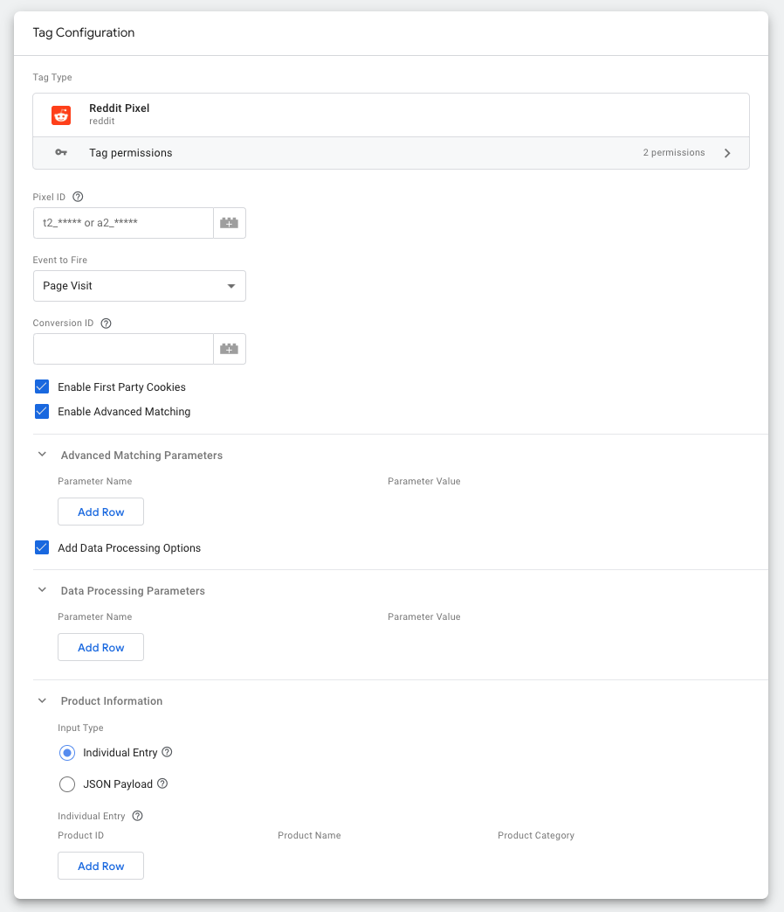

# Reddit Pixel Google Tag Manager Tag Template

The official tag template for the Reddit conversion pixel for use with Google Tag Manager

## Deployment
1. Follow [Google's instructions](https://developers.google.com/tag-platform/tag-manager/templates/gallery#update_your_template) for updating the template.  A sample diff can be found in [Pull Request #12](https://github.com/reddit/reddit-gtm-template/pull/12).
2. Google says the changes will be available in the gallery in 2 to 3 days, but in practice it usually takes only a few hours. Check the "Last Updated" date here: Tag Manager Template Gallery.
3. Check the commit hash of the template in the gallery is what you expect.  Test adding the template to your tag manager account, and check the features match what you expect.

Verification: The date on gallery entry and hash displayed in template info in imported template list should match what was expected.
